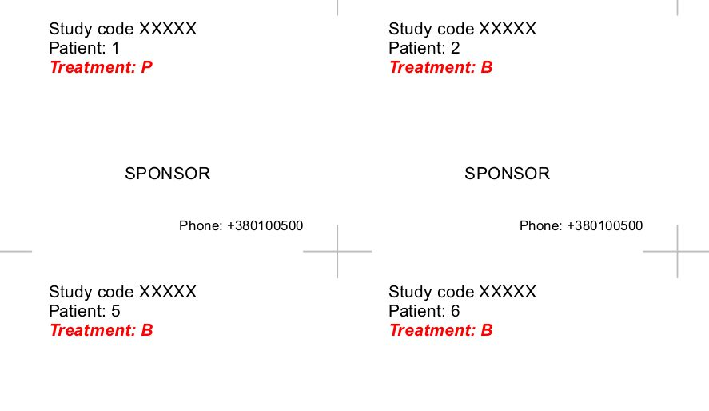
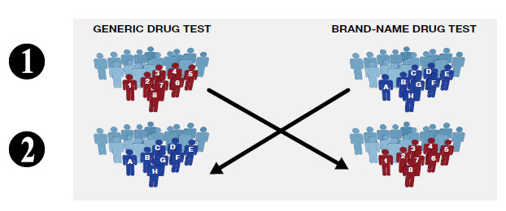
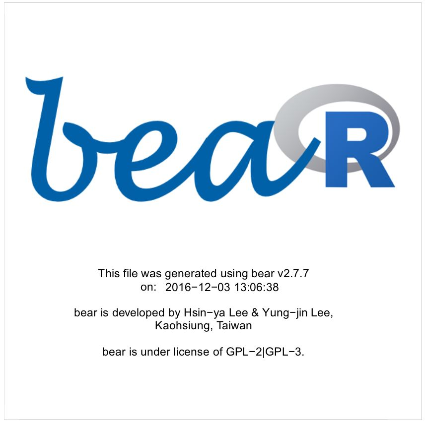
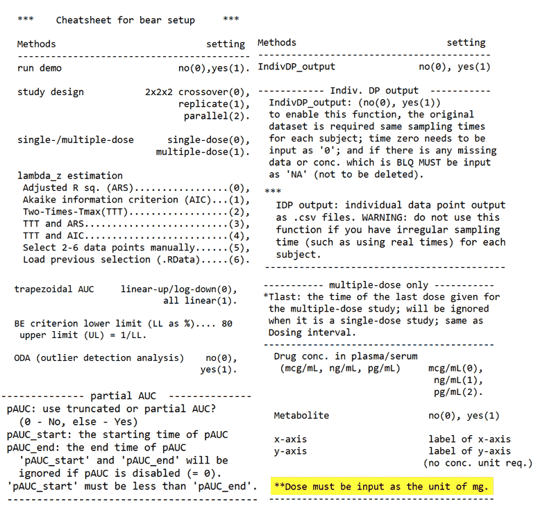
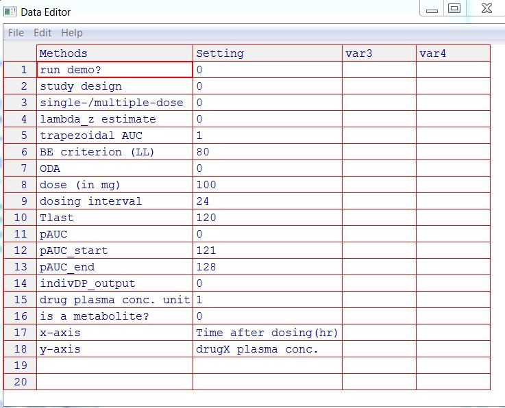

---
output:
  revealjs::revealjs_presentation:
   transition: slide
   self_contained: false
   css: white-helv.css
   highlight: default
   reveal_options:
     slideNumber: 'c/t'
     center: false
---


```{r, echo = FALSE}
library(knitr)
```


## Использование R в ходе клинических исследований

Андрей Огурцов

ПАО НПЦ «Борщаговский химико-фармацевтический завод»


## Особенности фармацевтической отрасли

Законодательное регулирование:

- США - FDA

- Европа - EMA, ICH

- Украина - «Державний Експертний Центр МОЗ»

Мы руководствуемся рекомендациями «International Council for Harmonisation of Technical Requirements for Pharmaceuticals for Human Use (ICH)».

Вопросы статистики и обработки данных рассмотрены в *E9 Statistical Principles for Clinical Trials* и *Guideline on the Investigation of Bioequivalence*.


## Особенности фармацевтической отрасли (продолжение)

- Open Source-решения не запрещаются, но и не пропагандируются

- FDA в 2012 г. официально [одобрило](http://blog.revolutionanalytics.com/2012/06/fda-r-ok.html) использование R при условии воспроизводимости анализа и результатов

- Коммерческое ПО (SAS, Stata, WinNonlin) по-прежнему преобладает


## Применение R

- Задачи машинного обучения - редкость (**xgboost** не нужен)

- Крайне важен этап планирования: расчет размера выборки, рандомизация, (суррогатные) конечные точки

- Статистический анализ требует проверки предпосылок используемых критериев

- Иногда нужны относительно экзотические критерии

- Предпочтительнее использовать консервативные методы (например, поправка Бонферрони для борьбы с эффектом множественных сравнений)


## Расчет размера выборки

- Зависит от типа и целей исследования (неуступающая/превышающая эффективность, терапевтическая эквивалентность, биоэквивалентность), от конечных точек, от количества групп

- В пакете **TrialSize** реализовано более 80 функций для расчетов

- Но можно посчитать и вручную, в том числе с помощью бутстрепа (если есть данные пилотного исследования)

- Лучше быть пессимистом и предусмотреть выбывание пациентов


## Пример расчета 1

Cравнение двух средних арифметических в исследовании на неуступающую/превышающую эффективность (разность средних равна 5, стандартное отклонение равно 10):

$$n = \frac{2(z_{\alpha} + z_{\beta})^{2} \sigma^{2}}{ (\epsilon - \delta)^{2}}$$

```{r}
library(TrialSize)
n <- TwoSampleMean.NIS(alpha = 0.025, 
                       beta = 0.2, 
                       sigma = 10, 
                       k = 1, 
                       delta = 0, 
                       margin = 5)
ceiling(n)
```

Предполагается нормальное распределение!


## Пример расчета 2

Для исследования биоэквивалентности:

$$n = \frac{(z_{\alpha} + z_{\beta /2})^{2} \sigma_{1,1}^{2}}{2 (\delta - \left | \epsilon  \right |)^{2}}$$


```{r, message = FALSE}
sampleSize <- function(sigma, epsilon, pwr) {
    ceiling((qnorm(0.05, lower.tail = FALSE) + 
            qnorm((1 - pwr) / 2, lower.tail = FALSE))^2 *
            (sigma ^ 2) / (2 * (0.223 - epsilon) ^ 2))}
sampleSize(sigma = 0.28, epsilon = 0.05, pwr = 0.80)

PowerTOST::CVfromCI(lower = 0.91, upper = 1.15, n = 21, 
                    design = "2x2", alpha = 0.05)
```


## Bootstrap

```{r}
set.seed(100500)
df <- data.frame(group = rep(c("plac", "treat"), each=10),
                 pressure = c(rnorm(10, 140, 20) + 
                                  rnorm(10, 150, 30), 
                              rnorm(10, 135, 30) + 
                                  rnorm(10, 125, 40))/2)

library(purrr)
library(psych)
res <- split(df, df$group) %>% 
    map(~ describe(.$pressure)) %>% 
    do.call(rbind, .)
```

```{r, echo = FALSE}
kable(res[, 2:9])
```


## Bootstrap

```{r}
shapiro.test(df[df$group == "plac", 2])

n <- TwoSampleMean.NIS(alpha = 0.025, 
                       beta = 0.2, 
                       sigma = 
                         sqrt(res$sd[2]^2 + res$sd[1]^2), 
                       k = 1, 
                       delta = 0, 
                       margin = res$mean[2] - res$mean[1])
ceiling(n)
```


## Bootstrap

```{r}
set.seed(500)
new <- data.frame(group = rep(c("plac", "treat"), each=60),
                  pressure = c(
                      sample(df[df$group == "plac", 2], 
                             60, replace = TRUE), 
                      sample(df[df$group == "treat", 2], 
                             60, replace = TRUE)))
shapiro.test(new[new$group == "plac", 2])
```


## Bootstrap

```{r}
library(broom)
t.test(pressure ~ group, data = new) %>% 
    tidy() %>% kable()
wilcox.test(pressure ~ group, data = new) %>% 
    tidy() %>% kable()
```


## Bootstrap

```{r}
reps_expr <- quote(
    data.frame(group = rep(c("plac", "treat"), each=60),
                  pressure = c(
                      sample(df[df$group == "plac", 2], 
                             60, replace = TRUE), 
                      sample(df[df$group == "treat", 2], 
                             60, replace = TRUE))))

reps <- replicate(1000, eval(reps_expr), simplify = FALSE)
p_vals <- map_dbl(
    reps, ~wilcox.test(pressure~group, data = .x)$p.value)
mean(p_vals < 0.05)
p_vals <- map_dbl(
    reps, ~t.test(pressure~group, data = .x)$p.value)
mean(p_vals < 0.05)
```


## Пакет boot

```{r, message = FALSE}
library(boot)

medDif <- function(data, indices) {
    d <- data[indices, ] 
    res <- median(d[d$group == "treat", 2]) - 
           median(d[d$group == "plac", 2])
    return(res)
}

results <- boot(data = new, 
                statistic = medDif, 
                R = 1000,
                strata = new$group)
```


## Пакет boot

```{r}
plot(results)
boot.ci(results, type = "basic")
```


## Пакет boot

```{r}
boot.ci(results, type = "basic")
```


## Рандомизация

Рандомизация - случайное распределение субъектов в группы для минимизации систематической погрешности.

```{r}
library(blockrand)

rand <- blockrand(n = 240, 
                  num.levels = 3, 
                  levels = c("A", "B", "P"),
                  block.sizes = rep(10, 8))
```


```{r, echo = FALSE}
kable(head(rand))
```


## Схема рандомизации

```{r}
rand_txt <- list(text = c("Study code XXXXX", 
                          "Patient: %ID%" , 
                          "Treatment: %TREAT%"),
                          col = c("black","black","red"),
                          font = c(1, 1, 4))
plotblockrand(rand, "rand.pdf",
              top = rand_txt,
              middle = "SPONSOR",
              bottom = "Phone: +380100500",
              cut.marks = TRUE, nrow = 4, ncol = 4)
```





## Исследование биоэквивалентности

- Сравниваются фармакокинетические параметры тестового (T) и референтного (R) препаратов

- Перекрестный дизайн: 2 препарата, 2 периода, 2 последовательности (2х2х2)

- Критерий эквивалентности: 90% доверительный интервал для *отношений средних геометрических* C<sub>max</sub> и AUC<sub>0-t</sub> находится в пределах 0.8000–1.2500 (80.00–125.00%)




## Данные для анализа

```{r}
data <- read.table("testdata.txt", sep = "\t", 
                   dec = ",", header = TRUE)
kable(head(data))
```

AUC<sub>0-t</sub> вычисляется методом трапеций, все фармакокинетические параметры перед анализом логарифмируются.


## Расчет AUC<sub>0-t</sub>

```{r, echo = FALSE, message = FALSE}
library(ggplot2)
library(ggiraph)
time <- unique(data$time)
data$seq <- factor(data$seq)
data$prd <- factor(data$prd)
data$drug <- factor(data$drug)
data$subj <- factor(data$subj)
```

```{r}
aucCalc <- function(conc, time) {
    auc <- numeric(length(time)-1) 
    for (i in 2:length(time)) {
        auc[i-1] <- 0.5 * (conc[i] + conc[i - 1]) * 
                          (time[i] - time[i - 1])
    }
    return(sum(auc, na.rm = TRUE))
}
```

```{r, echo = FALSE}
data$subj2 <- paste(data$subj, data$drug, sep = "")
data$subj2 <- factor(data$subj2, 
                     levels = unique(data$subj2), 
                     ordered = TRUE)

p <- ggplot(data, aes(time, conc, colour = subj2)) +
    geom_line(aes(linetype = drug), size = 0.6) + geom_point() + 
    guides(col = guide_legend(ncol = 4)) +
    theme(legend.title = element_blank()) +
    labs(title = 
        "Фармакокинетические кривые для препаратов T и R", 
         x = "Время, ч", y = "Концентрация")
```


## Визуализация

```{r, echo = FALSE}
plot(p)
```

```{r, echo=FALSE, eval=FALSE}
enc2utf8
```


## Смешанная линейная модель

Линейная модель с фиксированными и случайными эффектами имеет вид

$$ y = X \beta + Zb + \epsilon$$

Реализация в R - пакет **nlme**, функция `lme()`:

```{r}
library(nlme)
results <- data[data$time == 0, c(1:4)]
results$Cmax <- tapply(data$conc, data$subj2, 
                       max, na.rm = TRUE)
results$Cmax <- as.numeric(results$Cmax)
results$auc <- tapply(data$conc, data$subj2, 
                      aucCalc, time = unique(data$time)) 
results$auc <- as.numeric(results$auc)

model_Cmax <- lme(log(Cmax) ~ drug + prd + seq, 
                  random = ~1|subj, results)
model_auc <- lme(log(auc) ~ drug + prd+ seq, 
                 random = ~1|subj, results)
```


## Расчет доверительных интервалов 

```{r}
ci.Cmax <- intervals(model_Cmax, level = 0.9, 
                     which = "fixed")
ci.auc <- intervals(model_auc, level = 0.9, 
                    which = "fixed")
ci1 <- exp(ci.Cmax$fixed[2, ]) * 100
ci2 <- exp(ci.auc$fixed[2, ]) * 100
ci1_2 <- rbind(ci1, ci2)
colnames(ci1_2) <- c("Нижняя граница 90% ДИ, %", 
                     "Соотношение T/R, %",
                     "Верхняя граница 90% ДИ, %")
rownames(ci1_2) <- c("Cmax", "AUC(0-t)")
kable(ci1_2)
```

Реализация в виде **shiny**-приложения: [http://statist.shinyapps.io/bioeq](http://statist.shinyapps.io/bioeq)


## Пакет bear

[http://pkpd.kmu.edu.tw/bear/](http://pkpd.kmu.edu.tw/bear/)




## Инструкция




## Настройки




## Спасибо за внимание!

Презентация создана при помощи **revealjs**

[https://github.com/statist-bhfz/user_group_kiev](https://github.com/statist-bhfz/user_group_kiev)